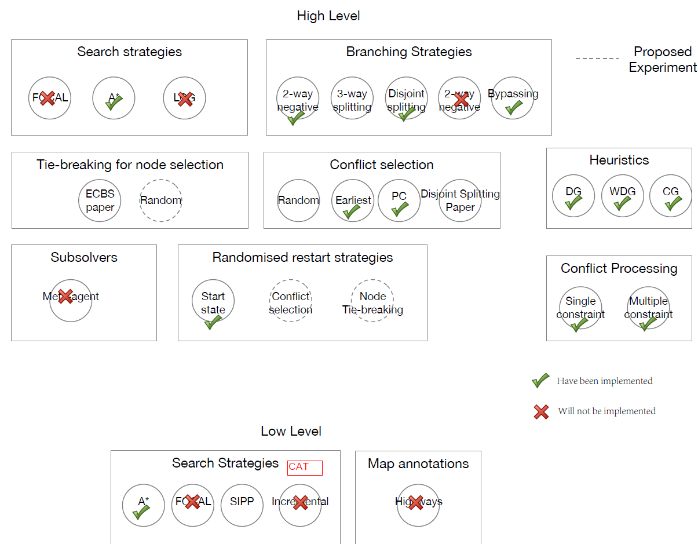

# CBS-variants
Variants of Conflict-Based Search.
 
 The code requires the external library BOOST (https://www.boost.org/).
 
 

 
## To do:

1. Add disjoint splitting -- done with the main framework, but still need different agent selection strategies and the landmark method.

2. Add sipp (or scipp) -- done! But the current SIPP does not work for >length constraints.

3. Add bypassing -- done with BP1. Do we need BP2 in https://docs.wixstatic.com/ugd/749b4b_6c85984d14ff4379b3a4400aab955b7b.pdf?

4. Add random restart -- done with the random permutation of the orders of agents that plan paths at the root node.
