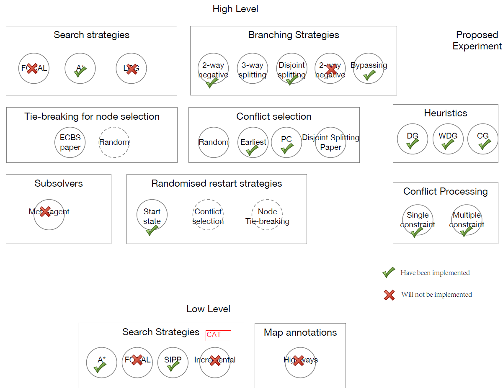

# CBS-variants
Variants of Conflict-Based Search.
 
 The code requires the external library BOOST (https://www.boost.org/).
 

  
 
## To do:

1. Add disjoint splitting -- done with the main framework, but still need different agent selection strategies and the landmark method.

2. Improve the efficiency of sipp (or scipp), and let SIPP handle >length constraints.

3. Add bypassing -- done with BP1. Do we need BP2 in https://docs.wixstatic.com/ugd/749b4b_6c85984d14ff4379b3a4400aab955b7b.pdf?
   * Does bypass help the 2-agent solver for WDG?

4. Fix the bug in random restart.

## Parameters:
 1. Heuristics (*choose one*)
    * Zero
    * CG
    * DG
    * WDG
 2. Conflict Selection (*choose one*)
    * Random
    * Earliest
    * Most conflicts
    * Most constraints
    * Least constraints
    * Width
    * Singletons
    * Prioritized Conflicts (PC) with tie-breaking (*choose one*)
      * Random
      * Earliest
      * Most conflicts
      * Most constraints
      * Least constraints
 3. Node Selection (*choose one*)
    * Random
    * Smallest h
    * Depth-first
    * Number of conflicts
    * Number of conflicting pairs
    * MVC on the conflict graph
 4. Symmetry reasoning  (*choose multiple*)
    * Rectangle
    * Corridor
    * Target
    * Mutex
 5. Branching (*choose one*)
    * Non-disjoint
    * Disjoint
 6. Bypassing (*choose one*)
    * BP1 (no lookahead)
    * BP2 (depth-first lookahead)
    * 2-agent
 7. Random Restarts  (*choose multiple*)
    * Root
    * All
 8. Low-Level Search (*choose one*)
    * A*
    * SIPP without CAT
    * SIPP with CAT
